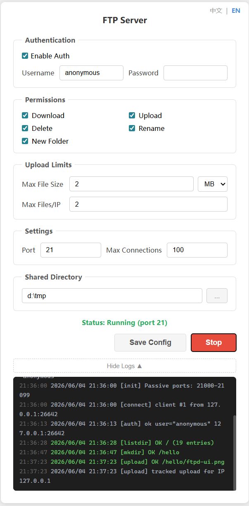

# goftpd

A minimal FTP server with a web management UI. Double-click to run, configure in your browser.

[中文文档](README_cn.md)



## Features

- **Web UI** — Configure, start, and stop from the browser. No CLI needed.
- **Permission Control** — Toggle download, upload, delete, rename, and mkdir individually.
- **Upload Limits** — Cap per-file size (MB/GB) and per-IP file count. Over-sized files are rejected before or during transfer with auto-cleanup.
- **Hot Reload** — Change config while running. All connected clients see updates immediately.
- **Anonymous Login** — Supports anonymous access by default; set username/password if needed.

## Quick Start

```bash
# Launch Web UI (default, opens browser automatically)
go run .

# Or build and run
go build -o goftpd.exe .
./goftpd.exe

# CLI mode (no UI)
go run . -gui=false
```

Configure the shared directory, permissions, and port in the browser, then click **Start**.

## Configuration

Edit `config.ini`:

```ini
[auth]
enabled  = true
username = anonymous
password =

[permissions]
download             = true
upload               = true
delete               = true
rename               = true
mkdir                = true
max_upload_file_size = 0
max_ip_files         = 0

[network]
port            = 21
max_connections = 100

[storage]
shared_dir = .
```

- `port = 21` requires root/admin privileges; use `port = 2121` for local testing
- `shared_dir` accepts relative or absolute paths
- Empty `password` allows any password for the anonymous user
- `max_upload_file_size = 0` means unlimited; set in bytes (e.g. `104857600` = 100MB). The Web UI provides MB/GB dropdown
- `max_ip_files = 0` means unlimited; counts across all sessions from the same IP. Deleting a file frees up a slot

## Tech Stack

- [ftpserverlib](https://github.com/fclairamb/ftpserverlib) — FTP protocol
- [afero](https://github.com/spf13/afero) — Filesystem abstraction
- [ini.v1](https://gopkg.in/ini.v1) — Config parsing
- Go 1.25+
