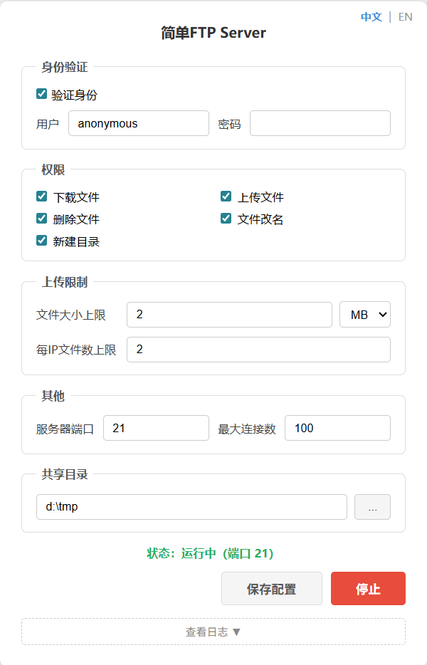

# goftpd

一个极简的 FTP 服务器，带 Web 管理界面。双击即用，浏览器管理。



## 功能

- **Web 管理界面** — 浏览器里配置、启动、停止，不用碰命令行
- **权限控制** — 下载、上传、删除、重命名、创建目录，逐项开关
- **上传限制** — 单文件大小上限（MB/GB）、每 IP 文件数上限，超限文件自动拒绝并清理
- **热更新** — 运行中改配置，已连接的客户端立即生效，无需重启
- **匿名登录** — 默认支持 anonymous 访问，也可设置用户名密码

## 快速开始

```bash
# 默认启动 Web 管理界面，自动打开浏览器
go run .

# 或编译后运行
go build -o goftpd.exe .
./goftpd.exe

# 纯命令行模式（无 GUI）
go run . -gui=false
```

启动后在浏览器里配置共享目录、权限、端口，点击「启动」即可。

## 配置

配置文件 `config.ini`：

```ini
[auth]
enabled  = true
username = anonymous
password =

[permissions]
download             = true
upload               = true
delete               = true
rename               = true
mkdir                = true
max_upload_file_size = 0
max_ip_files         = 0

[network]
port            = 21
max_connections = 100

[storage]
shared_dir = .
```

- `port = 21` 需要 root/管理员权限，本地测试用 `port = 2121`
- `shared_dir` 支持相对路径和绝对路径
- `password` 留空时 anonymous 用户接受任意密码
- `max_upload_file_size = 0` 表示不限；单位为字节（如 `104857600` = 100MB），Web 界面提供 MB/GB 下拉选择
- `max_ip_files = 0` 表示不限；同一 IP 跨所有会话累计，删除文件会释放名额

## 技术栈

- [ftpserverlib](https://github.com/fclairamb/ftpserverlib) — FTP 协议
- [afero](https://github.com/spf13/afero) — 文件系统抽象
- [ini.v1](https://gopkg.in/ini.v1) — 配置解析
- Go 1.25+
